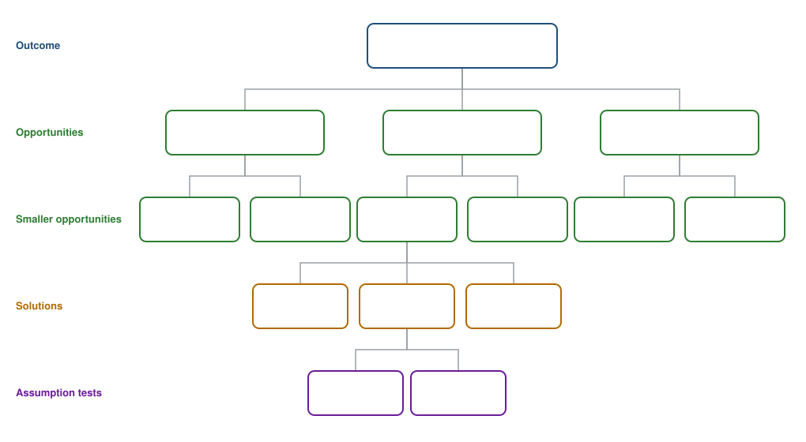

# Opportunity solution tree - blank template

A blank copy of the tree from Teresa Torres's [Opportunity Solution Trees](https://www.producttalk.org/opportunity-solution-trees/). Copy this file and fill it in from the top down.

## The four levels

- **Outcome:** the one measurable result the team is trying to move.
- **Opportunity:** a customer need, pain point or desire, in the customer's words.
- **Solution:** one way to address a single opportunity. Aim for several per opportunity so they can be compared.
- **Assumption test:** the smallest check that would tell you whether a solution is worth building.

## The tree

**Outcome:**

- **Opportunity 1:**
  - **Smaller opportunity 1.1:**
    - **Solution A:**
      - Assumption test:
      - Assumption test:
    - **Solution B:**
      - Assumption test:
    - **Solution C:**
      - Assumption test:
  - **Smaller opportunity 1.2:**
- **Opportunity 2:**
  - **Smaller opportunity 2.1:**
- **Opportunity 3:**

## Checks before using it

- [ ] There is one outcome, and it is a number that can be measured.
- [ ] Every opportunity came from something a customer said or did.
- [ ] Every opportunity is worded as a problem the customer has.
- [ ] Each smaller opportunity sits under exactly one parent.
- [ ] The opportunity being worked on has at least three solutions to compare.
- [ ] Each solution has at least one assumption test written down.
